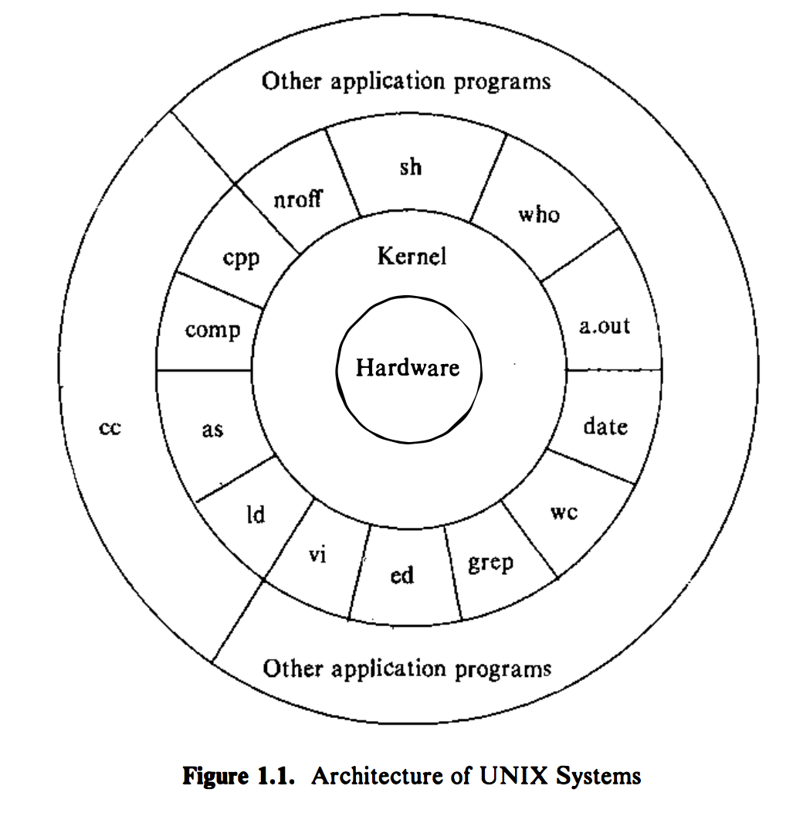

最近在学习《the design of the unix operating systems》，讲解形成操作系统基础（`the kernel`）的内部算法和架构，以及它们与编程人员接口的关系。阅读本书，可以对unix操作系统的内核工作原理有比较深刻的理解。本文记录学习心得，后续可能还有系列记录文章。

首先看看本书的目录
> - chapter 1 General overview of the system
- chapter 2 Introduction to the kernel
- chapter 3 The buffer cache
- chapter 4 Internal representation of files
- chapter 5 System calls for the file System
- chapter 6 The structure of processes
- chapter 7 Process control
- chapter 8 Process scheduling and time
- chapter 9 Memory management policies
- chapter 10 The I/O subsystem
- chapter 11 Interprocess communication
- chapter 12 Multiprocessor systems
- chapter 13 Distributed unix systems

最近半个月把前四章粗略看了下，每章里面的算法部分没有细看，主要还是先了解其原理。后续可以有针对性的进行精读。下面将每一章内容读后感或重点内容进行记录。

# Chapter 1
>Ken Thompson, Dennis Ritchie,and others sketched a paper design of a file system that later evolved into an early version of the UNIX file system.

### 发展历史
Unix操作系统由Bell实验室（AT&T）开发，最早（1977年达到500站点）主要应用于政府、大学等机构，后来各个开发者都在开发自己的私有Unix系统，其中，较著名的是Berkeley开发的BSD（Berkeley Software Distributed）。

Unix操作系统的流行得益于一下几个因素：
- 采用高级语言C编写，效率比汇编语言低20%～40%，但它易读、易懂、易修改和移植
- 简单的用户接口可以为用户提供想要的服务
- 提供原语，允许基于简单程序构建复杂程序
- 使用分级文件系统，允许简单维护和有效执行
- 使用统一的文件格式，字节流，使得应用程序开发简单
- 提供简单统一的外围设备接口
- 它是多用户、多进程系统；每个用户可以同时执行多个进程
- 它对用户隐藏了机器架构，使得开发不同硬件上的程序变得简单

*简单*，*统一* 是Unix的核心思想。

### 系统架构
<!---->
系统内核（`the kernel`）直接与硬件交互，并为应用程序提供公共服务，从而将应用程序与硬件隔离。

应用程序与kernel通过`system calls`进行交互。很多提供系统高级视图的应用子系统和程序，如`shell`，`vim`等，其实都是利用kernel提供的底层服务。

### 用户相关
#### file system
文件系统特征：
- 分层结构
- 文件数据的统一对待
- 创建和删除文件的能力
- 文件数据的保护
- 外围设备作为文件对待

文件系统是一棵树，根节点为`/`。

`program`不知kernel如何存储文件数据，而只是将数据作为无格式的字节流。

`directory`与普通文件类似，系统对待文件夹里的数据也作为字节流。

`permission`由文件的访问许可进行控制。

`device`也被系统作为文件对待。

#### processing environment
>`A program` is an executable file, and `a process` is an instance of the program in execution.

上面这句话是理解程序和进程区别所在的关键，即`program`是一个可执行的文件，而`process`是程序在执行中的一个实例。

多个进程可以同时执行，一个程序的多个实例可以同时共存。

多种`system calls`允许`process`创建新的进程、终止进程、同步进程执行的阶段以及控制各种事件的反应。

`shell`是一个用户程序，而不是内核程序。

#### building block primitives
Unix系统提供操作系统原语也便用户利用小的、模块化的程序作为建立复杂程序的构件。
- `redirect I/O`，如`ls > output`, `mail mjb < letter`等。
- `pipe`，如`grep main a.c b.c | wc -l`中`|`就是pipe操作。

pipes的使用可以避免临时文件的产生。

#### operating system services
kernel提供的服务有
- 控制进程的执行，如创建、终止或挂起、通信
- 公平调度进程在cpu上的执行，`time-shared`的方式
- 为正在执行的进程分配`main memory`
- 为用户数据的高效存储和检索分配`secondary memory`
- 允许受控进程访问外围设备，如终端、磁盘驱动器、硬盘驱动器、网络设备等

#### assumptions about hardware
`process`的执行分成两个等级：`user model`和`kernel model`。
